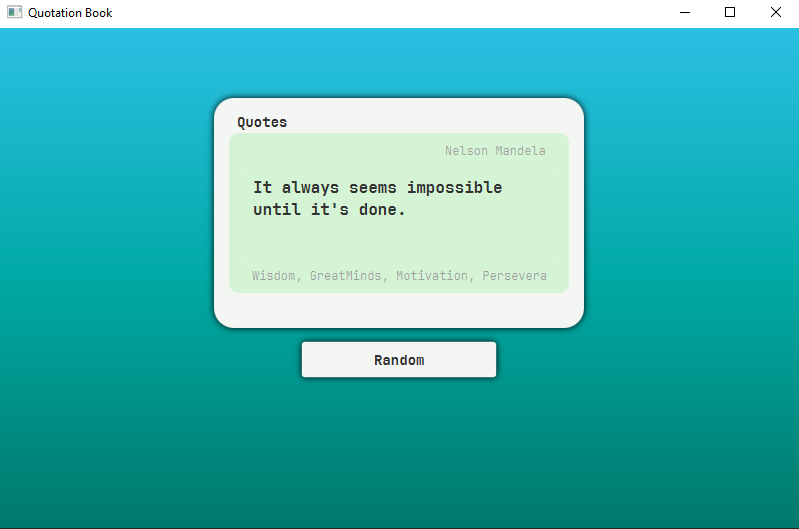

# Quotation Book

## Описание

Данный проект — концепт "идеи", которая появилась после просмотра обучающего видео [Евгения Сулейманова](https://www.youtube.com/watch?v=-nctg2wmZOA&list=PLlsMRoVt5sTM-Qhh47FGWrgwxeWjMeaP-&index=4).
> [Полное описание задания для ознакомления.](assets/DESCRIPTION.md)

Визуальная часть была сгенерирована в [**Leonardo AI**](assets/quotation-book-сoncept.png), а основа проекта была подготовлена вручную.

## Технологии

- **Java 21 (Full version)** – используется полная версия JDK 21, так как в неё включён JavaFX.
- **Gradle** – сборка проекта.
- **JavaFX** – визуальная часть приложения.
- **Spring Framework** – используется для реализации инверсии управления (IoC) и внедрения зависимостей.

## Состояние проекта

Каркас проекта **уже собран**, успешно запускается и выглядит следующим образом:

При нажатии на кнопку **"Random"** на экране отображается случайная цитата.

**Отображаемые данные:**

- Текст цитаты
- Автор цитаты
- Теги, связанные с этой цитатой (отображаются под цитатой)

## Контрибуции
Проект задуман как более интересная реализация [изначального задания](assets/DESCRIPTION.md). Форкайте, дорабатывайте, экспериментируйте — любые идеи приветствуются!